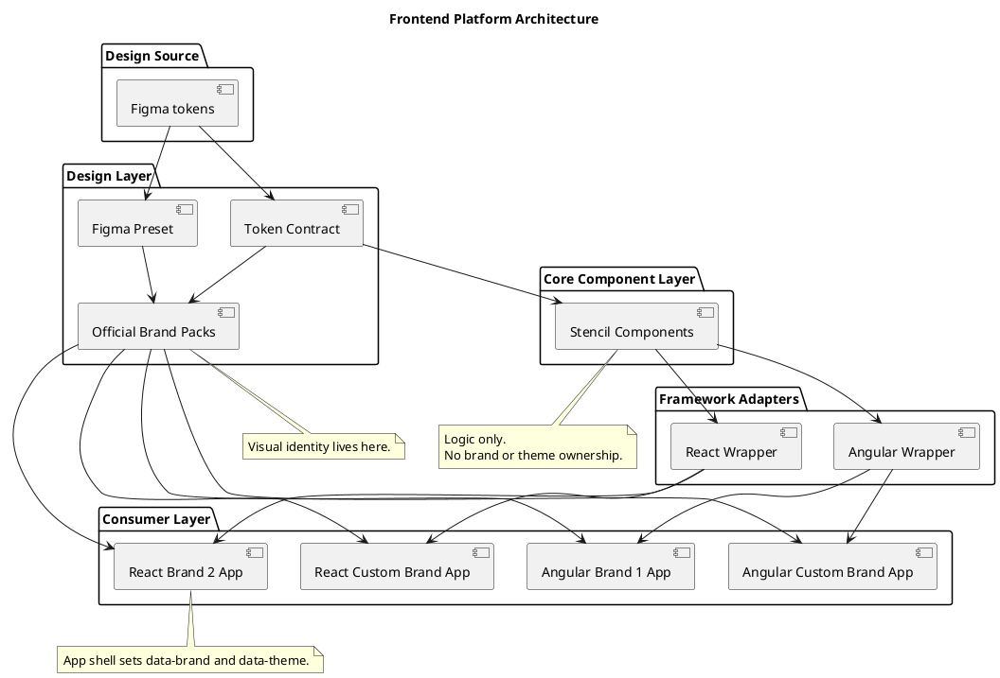
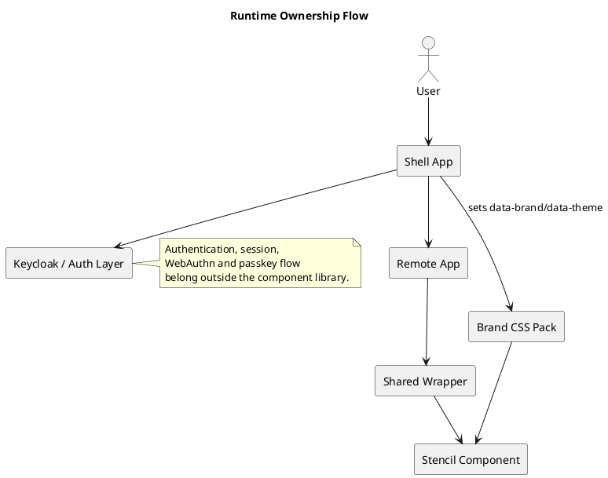

# RFC-000 Platform Architecture

## Status

Draft

## Context

A platformnak egyszerre kell tamogatnia:

- Angular reuse-t
- React fogyasztast
- frameworkfuggetlen komponenslogikat
- kulso styling libraryt
- multi-brand es light/dark modot
- microfrontend-kompatibilis shell ownershipet

## Decision

A platform negy fo retegbol all:

1. Stencil web component core
2. React es Angular wrapper library
3. token contract es official brand packek
4. consuming app shell, amely a `data-brand` es `data-theme` kontextust adja

## PlantUML - statikus architektura

## PlantUML - runtime ownership

## Consequences

### Positive

- egyszer irt komponenslogika
- central styling governance
- Angular es React reuse
- microfrontend-kompatibilis ownership modell

### Negative

- tobb csomag es release koordinacio
- eros public contract discipline kell
- wrapper drift veszely, ha nem maradnak vekonyak

## Rules

1. A komponensek ne kapjanak brand vagy theme propot.
2. A wrapper libraryk ne tartsanak sajat stylingot.
3. A shell ownership a consuming appban maradjon.
4. Copy ownership registry csak kiveteles escape hatch legyen.

## Rollout

1. `ff-button` mint referencia primitive fenntartasa
2. public token contract stabilizalasa
3. wrapper boundary tovabbi vedelme
4. tovabbi primitivek epítese ugyanezen a mintan
